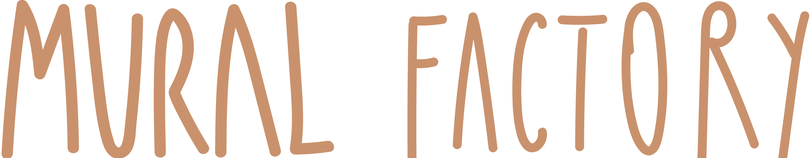

# muralfactory.ro website

<!-- LOGO -->
 

  

#### Bootsrap 5

## Contributing

1. Create your Feature Branch (`git checkout -b feature/MyFeature`)
2. Commit your Changes (`git commit -m 'Add some MyFeature'`)
3. Push to the Branch (`git push origin feature/MyFeature`)
4. Open a Pull Request

## Acknowledgements

-   [Start Bootstrap] (https://startbootstrap.com)

